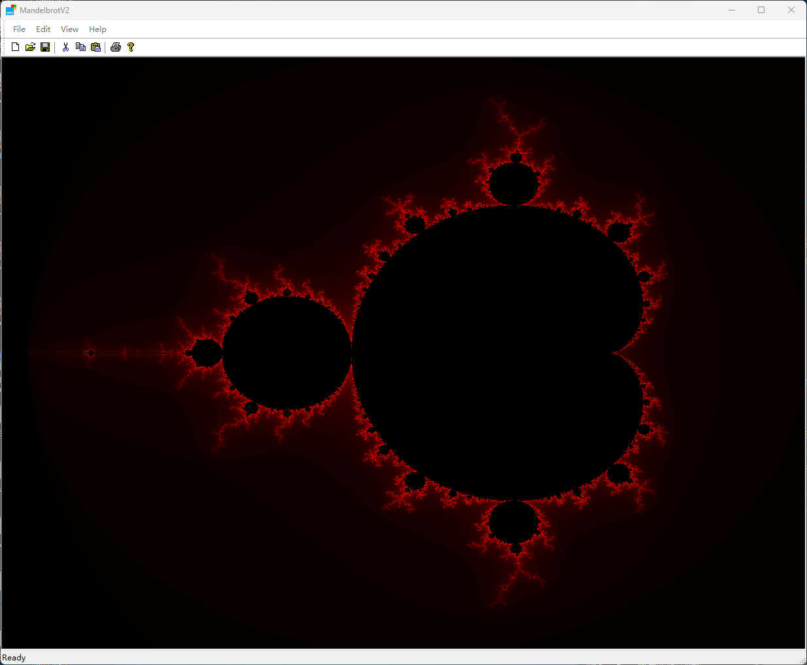

# MandelbrotV2

## Removing Work from a User-Interface Thread

Use the Concurrency Runtime Library to move the work that is performed by the user-interface (UI) thread in a WTL application to a worker thread.

Demo:

